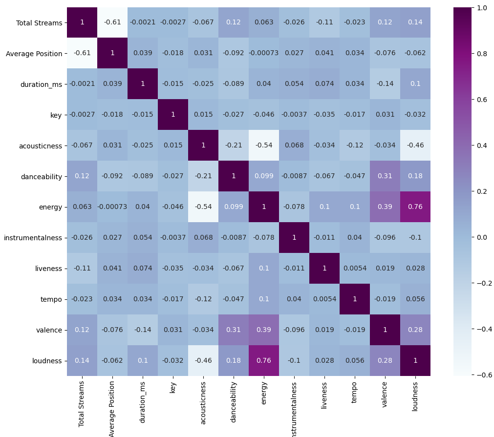

# Spotify Worldwide Trends Analysis
Zheng Lu, Judy Zhu

## Table of Contents
- [Overview](#Overview)
- [Introduction](#Introduction)
    * [Context and motivation](#Context-and-motivation)
    * [Objectives](#Objectives)
- [Data](#Data)
    * [Data provenance](#Data-provenance)
    * [Data description](#Data-description)
    * [Data processing](#Data-processing)
- [Exploration and analysis](#Exploration-and-analysis)
- [Discussion and conclusions](#Discussion-and-conclusions)
    * [Summary of findings](#Summary-of-findings)
    * [Evaluation of own work: strengths and limitations](#Evaluation-of-own-work-strengths-and-limitations)
    * [Comparison with any other related work](#Comparison-with-any-other-related-work)
    * [Improvements and extensions](#Improvements-and-extensions)

# Overview
This study is based on the "Worldwide Daily Song Ranking 2017-2018" dataset from Spotify -- a large music-streaming service provider. We first cleaned and wrangled the dataset with more informational columns. We were able to draw general conclusions on the correlations between region, timestamp, and the number of streams by colouring the world map according to the number of streams and plotting the trends of the globally top-ranking songs. For deeper analysis, we performed a PCA unsupervised clustering on the difference in the taste of songs between continents. After a failed try in simple linear regression, we added a random forest regression to predict the positions of music tracks. For further improvements, we carried out logistic regression to predict whether a song would be popular based on additional datasets and audio features. 

# Introduction

## Context and motivation
Due to the widespread use of the Internet, music streaming plays a critical role in our daily lives. In this report, we will analyse a set of data from one of the most extensive audio streaming and media services providers -- Spotify, containing daily rankings of 200-most-listened songs. The study may help the companies locate their customers and song taste based on regions and time. Its results may also give insights to music creators and song recommendation AIs into the different aspects that may affect the popularity of music tracks. 

## Objectives
We are setting out to answer the following questions:
- How does the number of streams distributed around the world?
- How do the positions of the global top-ranking song change over the year?
- Do regions share the same top-ranking artists or songs?
- Can we predict the position of a music track?
- Can we predict whether a music track would become popular based on its audio features?

# Data

# Data provenance
The data used for this project were downloaded from Kaggle's "Spotify's Worldwide Daily Song Ranking (Version 3)" as a CSV file. The dataset was crawled by Eduardo 4 years ago from the website [Spotify.Charts](https://www.kaggle.com/datasets/edumucelli/spotifys-worldwide-daily-song-ranking). The codes provide a copyleft license, [GNU General Public License v3.0](https://www.gnu.org/licenses/gpl-3.0.en.html), which includes permissions for commercial use, modification, distribution, patent use and private use. 

For the extension, we used the official [Spotify web API](https://developer.spotify.com/documentation/web-api/) to complement the song ranking dataset till the end of 2018 and acquire additional data on audio features. As required on the website for Spotify.Chart developers, we authenticated against their API by “client id” and “secret id” from Spotify Premium account before getting the data. 

## Data description
The main data from Spotify is a daily record of the top 200 playlists global and in 53 regions across the world. It contains 3441197 rows and 7 columns, including the position on charts (*Position*), name of the song (*Track Name*), artist of the song (*Artist*), the number of streams (*Streams*), the website address of the song (*URL*), the date for the record (*$Date*) and the region code (*Region*).

The audio features is also provided by a csv file, with 27802 rows and 26 columns providing 9 features: 
<!-- *duration(ms)*, *acousticness*, *danceability*, *energy*, *instrumentalness*, *liveness*, *tempo*, *valence* and *loudness* for each song. -->

|Attribute |Description|
|--- | --- |
|duration_ms (int) | Duration of the track in ms|
|acousticness (float) | A confidence measure from 0.0 to 1.0 of whether the track is acoustic.|
|danceability (float) | Danceability describes how suitable a track is for dancing based on a combination of musical elements including tempo, rhythm stability, beat strength, and overall regularity.|
|energy (float) | Energy is a measure from 0.0 to 1.0 and represents a perceptual measure of intensity and activity. Typically, energetic tracks feel fast, loud, and noisy.|
|instrumentalness (float) | Predicts whether a track contains no vocals. “Ooh” and “aah” sounds are treated as instrumental in this context. 
|liveness (float) |Detects the presence of an audience in the recording. Higher liveness values represent an increased probability that the track was performed live.| 
|tempo (int) | The overall estimated tempo of a track in beats per minute (BPM). In musical terminology, tempo is the speed or pace of a given piece and derives directly from the average beat duration.|
|valence (float) | A measure from 0.0 to 1.0 describing the musical positiveness conveyed by a track. Tracks with high valence sound more positive (e.g. happy, cheerful, euphoric), while tracks with low valence sound more negative (e.g. sad, depressed, angry).| 
|loudness | The overall loudness of a track in decibels (dB). 

## Data processing
For the song-ranking dataset, we first dropped the NaN rows, mostly the songs taken down, and the *URL* column since we will not use it in the analysis. Then, we split the *Date* column into *Year*, *Month* and *Weekday* columns, where the *Weekday* is the date of a week calculated by the python package *matplotlib.dates*. An additional column *Continent* is generated according to region codes by the package *geopandas*. We replaced the abbreviations of continents with their full names and distinguished the records with the same track name but different artists by renaming them differently.

For the extension part, we merged the two datasets and receive the record from the start of 2017 to the end of 2018. The dataset of the audio features is generally well structured. We dropped the only 5 NaN rows and transferred *Position* and *Streams* column values into numeric type for further analysis.

[Back to Top](#Table-of-Contents)

# Exploratory Data Analysis
Our exploration of the data is divided into two parts: the first part analysing the difference in music tastes across the world; the second part focusing on globally top-ranking songs and their patterns. For both parts, we have applied a machine learning technique to look into the problem.

We first visualised the distribution of streams across the world by drawing a pie chart, where the regions with streams in the upper 0.8 quantiles are displayed in the chart while the rest are integrated into the *Other* part. We observed that the United States of America users dominated the market, taking up more than a quarter of the total streams. This disparity may be due to the difference in population and lifestyle. The US has the third-largest population in the world, around 325.14 million in 2017, and also a wide use of mobile phones and audio devices. The number was followed by the United Kingdom, Brazil, Mexico and Germany, which all provided around 6% to 7% of the total streams. Those countries also have similar advantages. 

Then, we focused on the global trend of Spotify music. Filtered by the global region, the data provides the number of streams of 200 top-ranking songs for each day. We plotted the time against the position of the 10 songs with the highest number of streams. We observed that all the music tracks had at least a period reaching the top 20 positions. However, since July, almost all popular songs have gradually lost their leading positions. Those relatively short lifespans of the top-ranking songs may be due to the fast pace of current life so that people frequently change their song tastes over time. Also, interestingly, there is a significant decrease in positions for all the 10 songs at Christmas time. During this period, top songs include *"All I Want for Christmas Is You"* and *"Home for Christmas"* for lots of people played those songs for celebration. After that, their positions rose back and reached local maxima during New Year. 

Next, we looked into the question: Do people in different regions share the same top-ranking songs? In this section, each song in the dataset was considered to be a feature and was calculated by its streams over a region's total number of streams. A more significant percentage indicated the song's higher popularity in that particular region. We then used the unsupervised principal component analysis (PCA) to determine the most important features and reduce the dimensions. Thus our next step was to determine how many principal components should be included in our graph to be most informative.  

By plotting out the number of principal components against the variance of data, we observed an "elbow" at PC3 where the gradient changed sharply. The rule of thumb in our lecture notes would suggest that we use 3 PCs to describe the dataset in our following analysis.

As a result, the 3-dimensional PCA clustering was plotted by regions according to the three PCs and coloured based on their continents. We could easily see the clusters of data points. For a more rigorous result, we used K-means algorithms to determine the suitable number of clusters. K is plotted against the mean squared error (MSE) by the formula: 

where *mk* is the centre of the *k*th cluster, *n* is the total number of points, and | ⋅ | is the Euclidean norm. From the plot, we can then observe that the elbow is around *K=3*, implying that 3 is a reasonably good number of clusters.

Looking back into the PCA clustering plot, we can see the three clusters: two large ones on the positive and negative PC1 axis and a single point far away from all the others. Hence, we concluded that the Spotify users in Europe, Asia and Oceania tend to share similar music tastes, different from those in the American continent. Also, Luxembourg alone has the unique favour for top songs from the rest of the world. There are also 2 outliers marked in the figure: Spain, despite being a European country, has similar favour in songs with most South American regions, for they have a common speaking language, Spanish, and Latin American culture. Brazil, a country in South America, has its music taste more similar to the cluster of Eurasia than America. 

Finally, to answer whether we can predict music tracks' popularity, we focused on the global data and tried to generate a linear regression model. We used the multi-output regression since we can use the artists and streams to predict the rankings simultaneously. Again, PCA is applied to reduce the dimensions during the process of fitting and standardising the data. However, after plotting the linear regression of the actual versus prediction data, we observed that the outcome did not come out to be proportional to the change in inputs, and we calculated the root mean square error (RMSE) > 30. The non-linearity of data prevented our model from getting good predictions. 

Therefore, we introduced another regression method, the random forest -- a supervised machine learning algorithm that is an ensemble of decision trees. Firstly, the samples used to generate the decision trees are chosen by the bootstrap method, where we took various random sub-samples from the dataset with replacement. Then, we constructed a decision tree for each sample and got a prediction result. Here the mean squared error (MSE) is calculated by the formula: 

where *n* is the size of sample, *yi* is the actual value for data point *i* and *ŷi* is the predicted value by the model, is used to decide which branch to choose from each node. Especially, in order to make each tree unique enough to have own features, the decision trees are not pruned in the training. After a large amount of calculations, we received the prediction value from all the decision trees and averaged for the final result. The actual versus prediction line is drawn.

For a more precise prediction, we divided the model into three parts: "average rank position", "highest rank position", and "lowest rank position". After tuning and scaling the data by PCA features, we applied the above process of the multi-output and random forest regressor, and immediately received a model with testing scores every close to 1 and RMSE = 12.654. The visualisation of the actual versus prediction data also shows a reasonably good fit.

[Back to Top](#Table-of-Contents)

## Discussion and conclusions

### Summary of findings
We analysed various interesting observations with respect to two perspectives: the globally top-ranking music and the music popularity in different regions.

Due to the large population and widespread use of mobile devices, the United States users provide the largest number of streams, over 25%, followed by the United Kingdom, Germany, Mexico and Brazil.

Focusing on global rankings, we observed that the most-listened songs first raised almost instantly to the top positions, stayed for a certain period, and then gradually fell to lower positions. We concluded that the lifespan of a top-10 song is usually around six months. Also, the streams of almost all songs reached a trough during Christmas and regained their popularity before New Year.

We observed three clusters by plotting out the 3-dimensional PCA clustering of regions based on music tastes. One cluster was the American continent together with Spain; another cluster was made up of regions in Europe, Asia, and Oceania; the last cluster contained Luxembourg alone. The language was considered to be the main reason, as well as the cultural differences.

Finally, we focused on the prediction model of the positions of songs. We discovered the non-linearity of the dataset when doing the simple linear regression, so we additionally applied the random forest method. We arrived at 3 models predicting the lowest, average, and highest rankings with a good testing score very close to 1 and RMSE around 12. 

### Evaluation of own work: strengths and limitations

Besides the detailed discovery of the dataset, our group spent a significant amount of effort studying and applying new machine learning techniques. We discovered that the standard linear regression does not provide a perfect prediction for the ranks, so we introduced the random forest method that used a more complex algorithm to do the regression. This section's codes took a long time to run, but we finally received a good prediction model. 

To analyse the number of streams geographically, we drew the distribution across the world by colour depths and observed large grey areas in Asia and Africa where we did not get any data, indicating that the Spotify chart contains only a small number of countries and regions that their service covered. Especially, data from the limited number of regions in Asia made it insufficient to conclude general users' behaviour in the continent. 

Moreover, the time of the dataset is relatively short to train a perfect model of music rankings. For further study of music preference concerning geography, we may consider introducing other music streaming apps, such as Apple music and Joox, and datasets with a more extended period of time. 

### Improvements and extensions

In the extensions, we introduced a new dataset also from Spotify -- the audio features, to discover more factors contributed to the top-200 rankings. 

After cleaning and wangling the dataset, we were able to calculated the correlation of each pair of features for a heatmap of the audio features, the average positions and the number of streams. 

Instead, we decided to use the audio features to predict if a song would reach the top position on the Spotify chart. In addition to our linear regression, we carried out a logistic regression to predict whether a song is "popular" (relatively larger total number of streams) or "unpopular" (relatively smaller total number of streams) based on the audio features. For this section, we also imported an extra dataset of "Spotify Top 200 tracks" up to the end of 2018, merged it with the original data, and obtained the music records for two whole years. Our next step was to determine the threshold for predicting a positive outcome. 

We drew a Receiver Operating Characteristic (ROC) curve to test our model and chose the best threshold or cutoff value. In ROC, the y-axis is the sensitivity, representing the true positive ratio; the x-axis is the value of (1 - specificity), representing the false positive ratio. The $y=x$ diagonal line is the fifty-fifty random classifier. We want the model to have more true positive predictions than false positives, in other words, a curve closer to the top left of the plot. Here the area under the curve (AUC) is an overall summary of the quality of the model. It can be calculated by the [Wilcoxon-Mann-Whitney statistic](https://link.springer.com/chapter/10.1007/978-3-540-74976-9_8): 

where 1[*F*] is an indicator function that returns 1 if *F* is true and 0 otherwise, *D0* is the negative sample set, and *D1* is the positive sample set. We then drew the plot of matrix versus popularity score cutoff value. 

From the plot, we arrived at an optimal cutoff at 80. 

Additionally, we drew a normalised confusion matrix for the testing se. We can observe that for an actual popular music track, we had a larger than $70\%$ chance of truly predicting it; for not popular music, we might predict them correctly at a probability over $50\%$.

[Back to Top](#Table-of-Contents)
